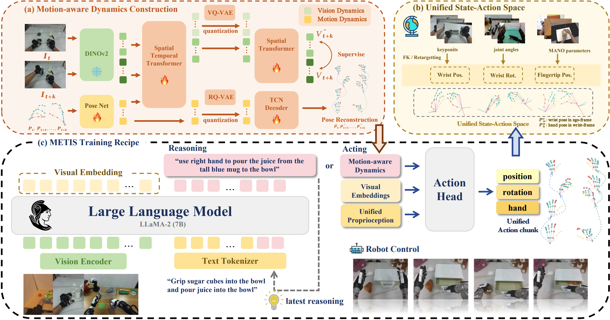

# METIS: Multi-Source Egocentric Training for Integrated Dexterous Vision-Language-Action Model 

<div align="center">

[](https://aureleopku.github.io/METIS/)
[](https://arxiv.org/abs/2511.17366)
<!--[](./LICENSE) -->
</div>

<!-- <div align="center">
  
</div> -->

METIS is a foundation model pre-trained on multi-source egocentric datasets, demonstrating exceptional capabilities in dexterous manipulation.

## Architecture

(a) We construct an expressive yet compact representation to capture the dynamics in dexterous manipulation. (b) METIS is pretrained on multi-source EgoAtlas dataset, where human and robot actions are align under a unified action space. (c) METIS integrates reasoning and acting within a framework, enabling effective deployment to downstream tasks.

### :fire: Highlights
- A multi-source egocentric manipulation dataset EgoAtlas, integrating diverse data sources under a unified state-action space. 
- A novel approach for extracting motion-aware dynamics from dexterous hand motion.
- A VLA that achieves state-of-the-art results on a range of real-world experiments.

## Set Up Conda Environments
```bash
git clone https://github.com/FlagOpen/RoboBrain_Dex
conda create -n metis python=3.10 -y
conda activate metis
# Our experiments are conducted with 'torch 2.2.0'

pip install -e .

# Install Flash Attention 2 for training (https://github.com/Dao-AILab/flash-attention)
pip install packaging ninja
ninja --version; echo $?  # Verify Ninja --> should return exit code "0"
pip install "flash-attn==2.5.5" --no-build-isolation
pip install -U 'jsonargparse[signatures]>=4.27.7'
```

## Dataset Process

We use **RLDS format** data for model finetuning. We provide a script to convert JSON data from Unitree's official data collection format ([avp_teleoperate/tree/g1](https://github.com/unitreerobotics/avp_teleoperate/tree/g1)) to RLDS.

- G1 (Unitree): Convert from Unitree official JSON format to RLDS (data layout: `<input_root>/<task_name>/episode_XXXXXX/data.json` and `colors/` images). The JSON must record arm end-effector poses in the base frame (`left_hand_pos_state`, `right_hand_pos_state`) and finger tip poses in the wrist frame (`left_fingertip_pos_state`, `right_fingertip_pos_state`).

We provide post-training data for the task of [pour the drink](https://huggingface.co/datasets/Auroraky/Dexterous_json_data), which can be used as a reference for the data format.

```bash
cd data_process/g1_process
python build_rlds_from_g1_state_action.py --input_root [input_root] --task_name [task_name] --output_dir [output_dir]
```

After converting to RLDS, register the dataset (which, for example, pour_the_drink) with our dataloader by adding an entry for it in configs.py ([here](metis/vla/datasets/rlds/oxe/configs.py#L192)), transforms.py ([here](metis/vla/datasets/rlds/oxe/transforms.py#L1034)). For reference, in each of these files, there are sample entries for the G1 datasets that we used in our paper.

## METIS Motion Dynamics Training
```bash
cd motion_tokenizer
torchrun --standalone --nnodes 1 --nproc-per-node 1 main.py fit --config config/motion_tokenizer.yaml 2>&1 | tee motion_tokenizer.log
```

## METIS Pretraining (Optional)

The VLA backbone is initialized from [prism-dinosiglip-224px+7b](https://huggingface.co/TRI-ML/prismatic-vlms/tree/main/prism-dinosiglip-224px%2B7b) in the [Prismatic VLM](https://huggingface.co/TRI-ML/prismatic-vlms) family.

```bash
cd vla-scripts
torchrun --standalone --nproc-per-node 8 --nnodes 1 train.py --vla.type prism-dinosiglip-224px+mx-egoatlas --run_root_dir "vla_log"
## if pretrain with OpenXEmbodiment, torchrun --standalone --nproc-per-node 4 --nnodes 1 train.py --vla.type prism-dinosiglip-224px+mx-oxe --run_root_dir "vla_log"
```

### Multi-node distributed training
```bash
## master: 
cd vla-scripts
torchrun  --nproc-per-node 8 --nnodes 2 --node_rank 0 --master_addr 172.26.41.144 --master_port 28596  train.py --vla.type prism-dinosiglip-224px+mx-egoatlas --run_root_dir "vla_log" 2>&1 | tee train_master.log

## worker: 
cd vla-scripts
torchrun  --nproc-per-node 8 --nnodes 2 --node_rank 1 --master_addr 172.24.242.195 --master_port 28596  train.py --vla.type prism-dinosiglip-224px+mx-egoatlas --run_root_dir "vla_log" 2>&1 |tee train_worker.log
```


## METIS Posttraining
```bash
#download pretrained model
hf auth login
hf download Auroraky/METIS_Pretrained_Model --repo-type model --local-dir /your/local/path

#download pretrained motion dynamic model
hf download Auroraky/Motion_Dynamics_Model --repo-type model --local-dir /your/local/path
```

```bash
cd vla-scripts
torchrun --standalone --nnodes 1 --nproc-per-node 8 finetune_g1_rq.py \
    --vla_path "/path/to/pretrained-checkpoint" \
    --data_root_dir "/path/to/datasets" \
    --motion_dynamics_path "/path/to/motion_dynamics.pt" \
    --dataset_name "pour_the_drinks_into_the_glass" \
    --run_root_dir "finetune_log/test"
```

## Deploy Server
```bash
#in the server
conda activate metis
cd vla-scripts
torchrun --standalone --nnodes 1 --nproc-per-node 1 deploy_server.py --pretrained_checkpoint "/path/to/metis-checkpoint" --dataset_name "pour_the_drinks_into_the_glass"
```

## Deploy Server
We adapt METIS to the RoboBrain-3B backbone. Please refer to [Robobrain-Dex](https://github.com/FlagOpen/RoboBrain_Dex) for more details.

<div align="center">
  
</div>

## Acknowledgments

METIS builds upon [Univla](https://github.com/OpenDriveLab/UniVLA.git). We thank the authors for their contributions to the robotics and machine learning communities.

## Citation

If you find our work useful, please consider citing us and give a star to our repository! 🌟🌟🌟

**METIS**

```bibtex
@article{fu2025metis,
  title={METIS: Multi-Source Egocentric Training for Integrated Dexterous Vision-Language-Action Model},
  author={Fu, Yankai and Chen, Ning and Zhao, Junkai and Shan, Shaozhe and Yao, Guocai and Wang, Pengwei and Wang, Zhongyuan and Zhang, Shanghang},
  journal={arXiv preprint arXiv:2511.17366},
  year={2025}
}
```

